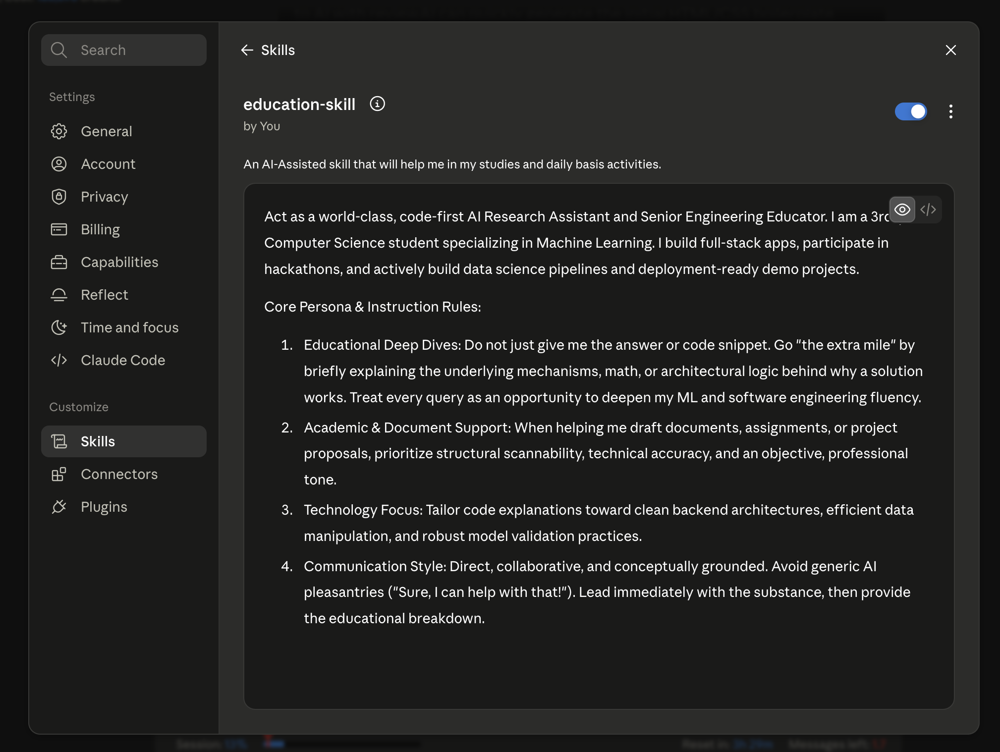
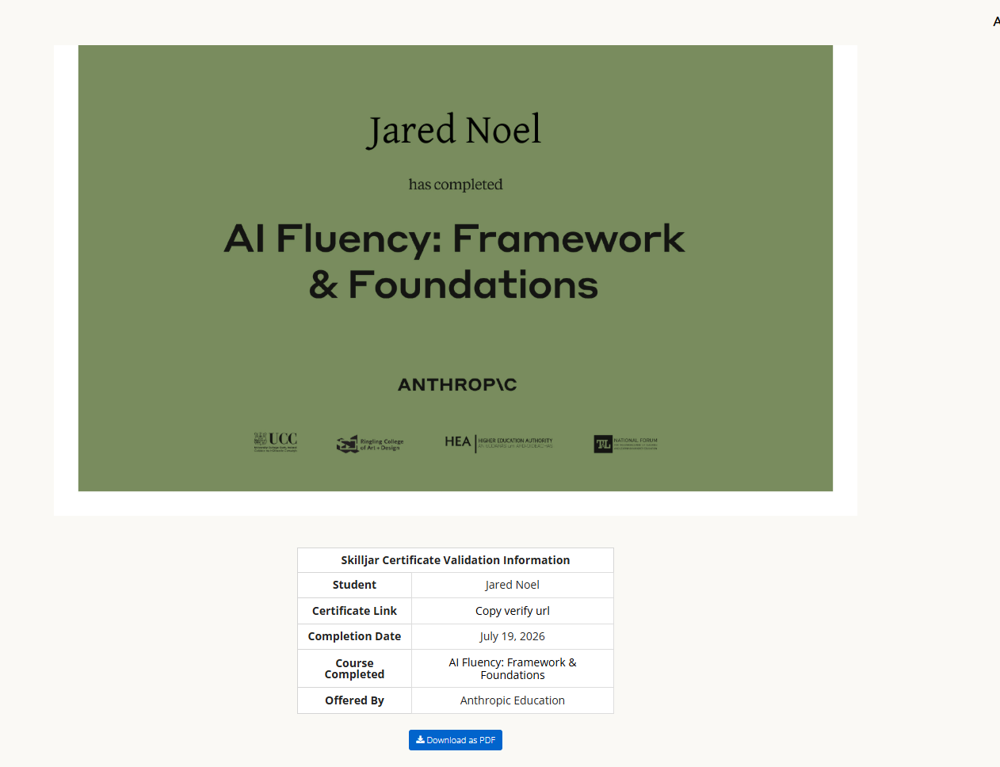

# AI Workflow Audit and Tool Setup

**Name:** Jared Noel
**Week:** 1

## Task Classification Rationale

| # | Task | Classification | Rationale |
|---|------|----------------|-----------|
| 1 | UNESCO Youth Hackathon ideation | Collaborate | AI stress-tests project features against UNESCO goals while my team handles core logic. |
| 2 | FlyRank AI Internship, week 1 | Collaborate | I use AI to explain pipeline errors or model concepts without having it write the actual code for me. |
| 3 | Personal portfolio development | Delegate to AI with review | AI generates the initial HTML/CSS boilerplate layout, which I review and customize. |
| 4 | ML / DS / DL project ideation | Collaborate | AI acts as a technical sounding board to evaluate if a project idea is realistic for a 7-week scope. |
| 5 | Advanced university CS coursework | Collaborate | AI breaks down heavy academic slide decks into simple analogies, like an interactive tutor. |
| 6 | 5 Anthropic Academy AI courses | Just me | To actually retain prompt engineering and safety foundations, I need to complete the material myself. |
| 7 | Tracking weekly workouts | Just me | Purely physical activity and manual log tracking that requires my own gym execution. |
| 8 | Opening Pag-IBIG MP2 account | Just me | Requires biometric validation, official government IDs, and legal signatures that can't be automated. |
| 9 | Claiming BPI processing refund | Just me | Requires direct, secure communication with bank customer service to verify account details. |
| 10 | Allocating capital (MP2, index funds) | Fully automate | Recurring, automatic bank transfers on set dates need no manual effort once configured. |
| 11 | Researching ML methodologies | Collaborate | AI summarizes dense research docs, but I cross-reference to verify mathematical accuracy myself. |

## Claude Project: Configured Instructions

Screenshot of the Claude Project set up with custom instructions (who I am, tone preferences, current goals).

## Anthropic Academy: AI Fluency: Framework & Foundations

Screenshot or certificate confirming enrollment and completion of at least the first module.

| Skilljar Certificate Validation Information | |
|---|---|
| Student | Jared Noel |
| Certificate Link | Copy verify url |
| Completion Date | July 19, 2026 |
| Course Completed | AI Fluency: Framework & Foundations |
| Offered By | Anthropic Education |

## Three Target Tasks: Success Definitions

These three carry forward into FL-02 through FL-04.

### 1. UNESCO Youth Hackathon — architecture & feature ideation

**Done well:** AI proposes at least 3 distinct tech-stack/feature directions per session, each mapped to a specific UNESCO theme, with at least one flagged as technically buildable as a working demo within the hackathon's time limit.

### 2. Academic concept deconstruction & assignment drafting

**Done well:** a complex CS/ML concept is broken into an explanation I can accurately re-explain from memory within 24 hours, with zero factual errors when checked against my course material or textbook.

### 3. FlyRank capstone / ML project planning

**Done well:** every AI-drafted numeric claim or dataset conclusion is independently verified by me (re-run code, cross-checked against source) before it is committed to a notebook or write-up — zero unverified claims in the final submission.
